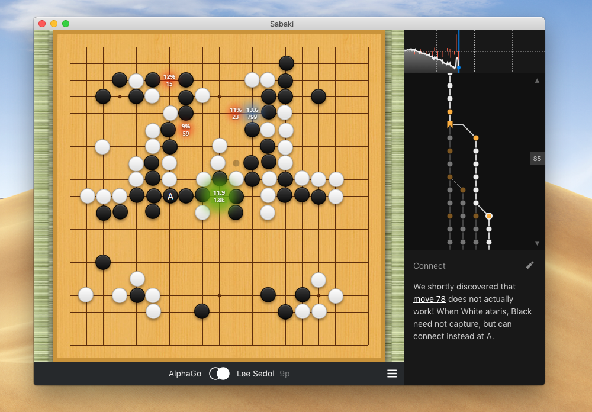

# This is a customized version of Sabaki (dump_state2)

For extenral tools (e.g. [LizGoban](https://github.com/kaorahi/lizgoban))

- Dump the game state successively to STDOUT. ([61a1256](https://github.com/kaorahi/Sabaki/commit/61a1256dd91ab93f433fe784d8db8bc76dc6324b), [68661e9](https://github.com/kaorahi/Sabaki/commit/68661e96f3bdf4187e7a96aac33216f0cd5dab9c), [24e60270](https://github.com/kaorahi/Sabaki/commit/24e60270bdf9fc2f98483b26f300cf0b254954d2))
- Extend the command line argument. e.g. 'foo.sgf#24' ==> Load foo.sgf and go to the 24th move ([93db46e](https://github.com/kaorahi/Sabaki/commit/93db46e96ec7d2f91ba88f0c4c04134be66b3789))

[Diff from master](https://github.com/SabakiHQ/Sabaki/compare/master...kaorahi:dump_state2)

# Sabaki  

An elegant Go/Baduk/Weiqi board and SGF editor for a more civilized age. [Download the latest release](https://github.com/SabakiHQ/Sabaki/releases) of Sabaki.

## Features

- Fuzzy stone placement
- Read and save SGF games and collections
- Open wBaduk NGF and Tygem GIB files
- Display formatted SGF comments using a [subset of Markdown](https://github.com/SabakiHQ/Sabaki/blob/master/docs/guides/markdown.md)
- Personalize board appearance with [textures & themes](https://github.com/SabakiHQ/Sabaki/blob/master/docs/guides/theme-directory.md)
- SGF editing tools
- Powerful undo/redo
- Lines & arrows board markup
- Copy & paste variations
- Fast game tree
- Score estimator & scoring tool
- Find move by move position and comment text
- Position & move annotations
- [GTP engines](https://github.com/SabakiHQ/Sabaki/blob/master/docs/guides/engines.md) support
- Board analysis with engines which support it
- Guess mode
- Autoplay games

## Documentation

For more information visit the [documentation](https://github.com/SabakiHQ/Sabaki/blob/master/docs/README.md). You're welcome to [contribute](https://github.com/SabakiHQ/Sabaki/blob/master/CONTRIBUTING.md) to this project.

## Web Version

Sabaki has a [`web`](https://github.com/SabakiHQ/Sabaki/tree/web) branch. It's a trimmed-down version of Sabaki that runs in any modern browser. You can try a [working demo here](https://sabaki.yichuanshen.de/web/).

If you're looking for the code of the [website](http://sabaki.yichuanshen.de/), you can find it in [this repository](https://github.com/SabakiHQ/sabaki-website).

## Building & Tests

See [Building & Tests](https://github.com/SabakiHQ/Sabaki/blob/master/docs/guides/building-tests.md) in the documentation.

## License

This project is licensed under the [MIT license](https://github.com/SabakiHQ/Sabaki/blob/master/LICENSE.md).

## Donators

A big thank you to these lovely people:

- Eric Wainwright
- Michael Noll
- John Hager
- David Göbel
- Dominik Olszewski
- Dimitri Rusin
- Philippe Fanaro
- Andrew Thieman
- Adrian Petrescu
- Karlheinz Agsteiner
- Sergio Villegas
- Jake Pivnik

## Related

* [Shudan](https://github.com/SabakiHQ/Shudan) - A highly customizable, low-level Preact Goban component.
* [boardmatcher](https://github.com/SabakiHQ/boardmatcher) - Finds patterns & shapes in Go board arrangements and names moves.
* [deadstones](https://github.com/SabakiHQ/deadstones) - Simple Monte Carlo functions to determine dead stones.
* [gtp](https://github.com/SabakiHQ/gtp) - A Node.js module for handling GTP engines.
* [immutable-gametree](https://github.com/SabakiHQ/immutable-gametree) - An immutable game tree data type.
* [influence](https://github.com/SabakiHQ/influence) - Simple heuristics for estimating influence maps on Go positions.
* [sgf](https://github.com/SabakiHQ/sgf) - A library for parsing and creating SGF files.
